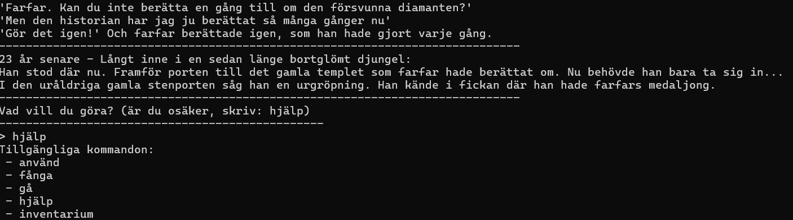

# Temple Diamond - Martina Halldin

**Valt alternativ:** [Textäventyr]

## Projektbeskrivning

Jag har valt att skapa ett textäventyr. Vi får följa en äventyrare som letar efter diamanten från en av farfars berättelser. 
Genom att förflytta sig genom templets alla rum och använda sig av de föremål man hittar under spelets gång tar äventyraren sig förhoppningsvis förbi den stora spindeln som vaktar diamanten. 

## Screenshot



På bilden ser du inledningsscenen i spelet. 


## Hur man startar programmet

### Förutsättningar

- .NET 8.0 eller senare
- En av följande utvecklingsmiljöer: Visual Studio, JetBrains Rider, Visual Studio Code, eller terminal/kommandotolk

### Klona projektet

```bash
git clone https://github.com/orgs/Campus-Molndal-CLO25/repositories/assignment-oop-[82marhal]]
cd assignment-oop-[82marhal]
```

### Starta programmet

#### Visual Studio

1. Öppna `TempleDiamond.sln` eller projektmappen
2. Tryck `F5` eller klicka på "Start" (grön triangel)

#### JetBrains Rider

1. Öppna projektmappen genom "File → Open"
2. Tryck `Ctrl+F5` eller klicka på "Run" (grön triangel)

#### Visual Studio Code

1. Öppna projektmappen: `code .`
2. Installera C# Dev Kit-tillägget om det saknas
3. Tryck `F5` eller använd "Run → Start Debugging"

#### Terminal/Kommandotolk

```bash
dotnet run
```

## Hur man använder programmet

Man navigerar genom programmet genom att ange korta textkommandon som kan kombineras med föremål (ex. fackla, stege) eller riktning (ex norr, söder).  
Tillgängliga kommandon:

 - använd
 - fånga
 - gå
 - hjälp
 - inventarium
 - lägg
 - sluta
 - ta
 - titta


## Funktioner

### Berättelse och introduktion

1. Spelet börjar med en liten berättelse (om farfar och diamanten) och Introducerar spelaren till världen och känslan av äventyr.

### Världsbyggande

2. Skapar alla rum, kopplar ihop dem med utgångar, Lägger ut föremål i specifika rum. Skapar spindelbossen. 

### Skapar spelarens karaktär

3. Spelaren startar i "Ingången". Den har ett inventarium (föremålssamling) och kan plocka upp, använda och lägga föremål.

### Navigering i världen

4. "gå [riktning]" flyttar spelaren mellan rum. Regler finns för speciella situationer (t.ex. för mörkt i rummet).

### Interaktion med världen

5. "titta" beskriver rummet och dess innehåll. "ta [föremål]" plockar upp föremål från rummet."använd [föremål]" har specialeffekter beroende på var man är. "lägg [föremål] i [behållare]" lägger föremål i andra föremål."fånga [föremål]" fångar [föremål] om villkoren är uppfyllda. "inventarium" listar vad spelaren bär på. "sluta" avslutar spelet.

### Boss-möte (Spindeln)

6. Kan besegras genom att dödas. Kan även passeras fredligt genom att särskilda kriterier uppnås.

### Spelets slut

7. När spelaren tar diamanten: Spelet har två alternativa slut, men bara ett av sluten leder till att spelaren kommer ut ur templet levande med diamanten. 

### Grundfunktioner

- [ ] Sammankopplade rum som spelaren kan röra sig mellan.
- [ ] Föremålshantering - Spelaren kan ta och använda föremål, de försvinner ur rummet när de tas och läggs i inventariet. 
- [ ] Rumsbeskrivning - Varje rum har en unik beskrivning
  [ ] Felhantering - Spelaren får felmeddelanden när den försöker göra något den inte ska eller skriver fel kommando. 
  [ ] Vinstvillkor - Det finns ett tydligt sätt att vinna spelet.

### Extra funktioner (för VG)

- [ ] Större värld - Spelet består av 10 unika rum.
  [ ] Låsta dörrar och nycklar - Det krävs nyckel för att komma in i templet och det krävs särskilda föremål för att komma in i vissa rum.
  [ ] NPC - En boss i form av en spindel som reagerar olika beroende på hur du behandlar den. 

## Projektstruktur

```
projektmapp/
├── Program.cs         # Huvudprogram
├── Item.cs            # Klass för föremål i spelet
├── ItemFactory.cs     # "Fabrik"-klass som skapar föremål
├── MainGame.cs        # Klass som hanterar start, världens uppbyggnad, kommandon och logik
├── Player.cs          # Klass som håller koll på spelares rörelse samt inventarie
├── Room.cs            # Klass för hur rum är uppbyggda
├── Spider.cs          # Klass som skapar spindelbossen
├── README.md          # Denna fil
├── Reflektion.md      # Reflektion över projektet

```

## Teknisk information

- **Programmeringsspråk:** C#
- **Framework:** .NET 8.0
- **Utvecklingsmiljö:** [Visual Studio Code / Visual Studio]


## Länkar

- **GitHub Repository:** https://github.com/orgs/Campus-Molndal-CLO25/repositories/assignment-oop-82marhal


---

_Skapad som del av kursen "Grundläggande objektorienterad programmering i C#" vid Yrkeshögskolan Campus Mölndal._
